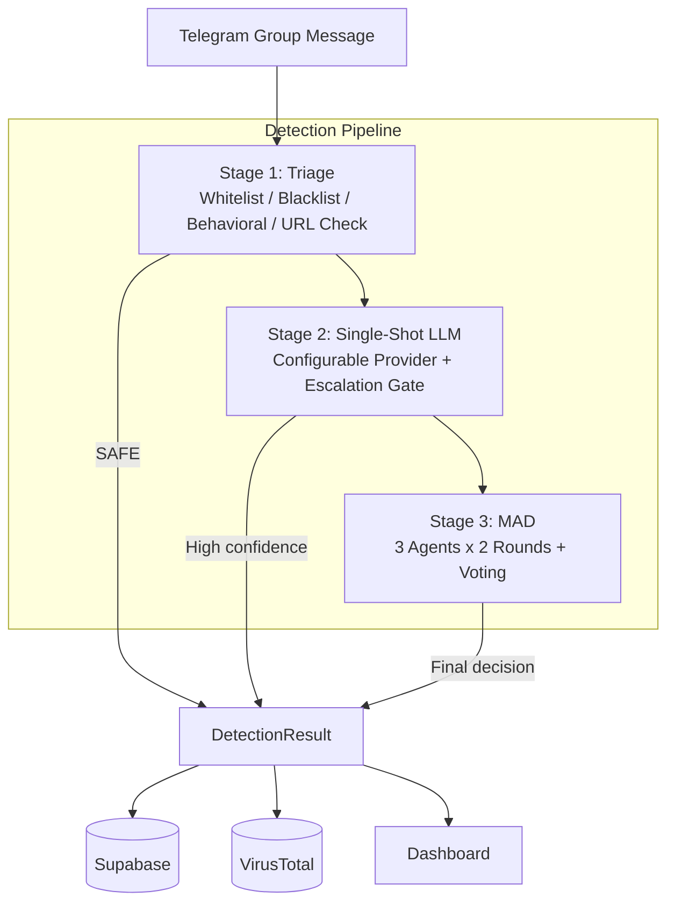

# 🛡️ TelePhisDebate

<p align="center">
  
</p>

<p align="center">
  <sub>Alternative monochrome icon: <a href="assets/telephis-icon-mono.svg">telephis-icon-mono.svg</a></sub>
</p>

**Phishing Detection Bot for Telegram using Multi-Agent Debate**

> Undergraduate Thesis Project — Computer Science, Universitas Islam Riau

[](https://python.org)
[](https://core.telegram.org/bots/api)
[](https://openrouter.ai)
[](https://deepseek.com)
[](https://supabase.com)
[](LICENSE)

---

## Overview

TelePhisDebate is a Telegram bot that detects phishing messages in academic group chats using a **hybrid 3-stage pipeline** combining rule-based filtering, single-shot LLM classification, and multi-agent debate.

The system is designed for Indonesian academic Telegram groups, specifically targeting compromised student accounts that send phishing links.

### Key Features

- **3-Stage Detection Pipeline** — Rule-based triage → Single-shot LLM → Multi-agent debate
- **Multi-Agent Debate (MAD)** — MAD3 (3-agent) sebagai mode default, MAD5 untuk eksperimen komparatif skripsi
- **Real-time Protection** — Processes messages in group chats automatically
- **URL Security Analysis** — VirusTotal integration, URL expansion, heuristic checks
- **Web Dashboard** — Real-time monitoring with brutalism B&W design
- **Evaluation Framework** — Built-in tools for accuracy/precision/recall/F1 testing
- **Decision-Focused Pipeline** — Trivial messages resolved at triage, ambiguous cases escalated for deeper analysis

---

## Architecture



ASCII fallback:

```
Telegram Group Message
         │
         ▼
┌─────────────────────────────────────────────────┐
│              DETECTION PIPELINE                  │
│                                                  │
│  ┌────────────┐  ┌─────────────┐  ┌──────────┐ │
│  │  Stage 1   │  │   Stage 2   │  │ Stage 3  │ │
│  │  Triage    │─→│ Single-Shot │─→│   MAD    │ │
│  │            │  │    LLM      │  │          │ │
│  │ • Whitelist│  │ • Configurable LLM │  │ 3 Agents │ │
│  │ • Blacklist│  │ • Prompt    │  │ 2 Rounds │ │
│  │ • Behavior │  │ • Escalate  │  │ Voting   │ │
│  │ • URL Check│  │   if unsure │  │          │ │
│  └────────────┘  └─────────────┘  └──────────┘ │
│       │ SAFE          │ High conf      │ Final  │
│       ▼               ▼                ▼        │
│              ┌──────────────────┐               │
│              │ DetectionResult  │               │
│              └──────────────────┘               │
└─────────────────────────────────────────────────┘
         │
    ┌────┼────────┐
    ▼    ▼        ▼
Supabase  VirusTotal  Dashboard
```

### Pipeline Stages

| Stage | Method | Purpose |
|-------|--------|---------|
| **1. Triage** | Rule-based (whitelist, blacklist, behavioral, URL analysis) | Fast filter — safe messages skip LLM |
| **2. Single-Shot** | Configurable LLM (OpenRouter default, DeepSeek optional) | AI classification for non-trivial messages |
| **3. MAD** | 3 agents × 2 rounds debate | Resolve ambiguous cases via consensus |

### MAD Agents

| Agent | Role | Focus |
|-------|------|-------|
| **Content Analyzer** | Linguistic analysis | Style deviation, social engineering tactics, urgency |
| **Security Validator** | Technical verification | URL reputation, domain analysis, VirusTotal data |
| **Social Context Evaluator** | Behavioral context | User history, timing anomalies, group relevance |

> Runtime bot menggunakan MAD3 sebagai default (`MAD_MODE=mad3`).
> MAD5 dipertahankan sebagai mode eksperimen/ablation untuk analisis hasil di skripsi.

---

## Evaluation Results

Tested on a dataset of **56 phishing messages** from real Indonesian Telegram groups:

| Metric | Score |
|--------|-------|
| **Accuracy** | 89.29% |
| **Precision** | 100% |
| **Recall** | 89.29% |
| **F1-Score** | 94.34% |

| Detail | Value |
|--------|-------|
| True Positives | 50 |
| False Negatives | 6 |
| False Positives | 0 |
| Avg Processing Time | 14.9s/msg |
**Stage distribution:** MAD handled 89.3% of messages (100% accuracy), Triage handled 10.7%.

---

## Project Structure

```
TelePhisDebate/
├── main.py                      # Bot entry point
├── run_dashboard.py             # Dashboard entry point
├── evaluate.py                  # Evaluation script
├── requirements.txt             # Python dependencies
├── .env.example                 # Environment template
│
├── src/
│   ├── config.py                # Configuration
│   ├── bot/
│   │   ├── bot.py               # TelePhisBot class
│   │   ├── handlers.py          # Message handler
│   │   └── actions.py           # Bot actions (warn, flag)
│   ├── detection/
│   │   ├── pipeline.py          # Pipeline orchestrator
│   │   ├── url_checker.py       # URL security (VirusTotal)
│   │   ├── triage/              # Stage 1: Rule-based
│   │   │   ├── triage.py
│   │   │   ├── whitelist.py
│   │   │   ├── blacklist.py
│   │   │   ├── url_analyzer.py
│   │   │   └── behavioral.py
│   │   ├── single_shot/         # Stage 2: LLM
│   │   │   ├── classifier.py
│   │   │   └── prompts.py
│   │   ├── mad/                 # Stage 3: Multi-Agent Debate (default runtime)
│   │   │   ├── agents.py
│   │   │   ├── orchestrator.py
│   │   │   └── aggregator.py
│   │   └── mad5/                # Experimental: 5-agent MAD variant
│   │       ├── agents.py
│   │       ├── orchestrator.py
│   │       └── aggregator.py
│   ├── llm/
│   │   ├── factory.py           # Provider router (OpenRouter / DeepSeek)
│   │   ├── openrouter_client.py # OpenRouter client
│   │   ├── deepseek_client.py   # DeepSeek API wrapper
│   │   └── json_utils.py        # Robust JSON parsing utilities
│   ├── database/
│   │   └── client.py            # Supabase client
│   └── dashboard/
│       ├── app.py               # Flask app + API
│       ├── templates/           # HTML (index, evaluation)
│       └── static/              # CSS, JS
│
├── data/                        # Test datasets
├── results/                     # Evaluation outputs
├── dataset/                     # TLD lists
├── tests/                       # Unit tests
└── docs/                        # Full documentation
```

---

## Quick Start

### Prerequisites

- Python 3.10+
- Telegram Bot Token (from [@BotFather](https://t.me/BotFather))
- [OpenRouter API Key](https://openrouter.ai) atau [DeepSeek API Key](https://platform.deepseek.com/)
- [Supabase](https://supabase.com) project (free tier works)
- VirusTotal API Key (optional, free tier)

### Installation

```bash
# Clone repository
git clone https://github.com/your-username/TelePhisDebate.git
cd TelePhisDebate

# Create virtual environment
python -m venv venv
source venv/bin/activate   # Linux/Mac
venv\Scripts\activate      # Windows

# Install dependencies
pip install -r requirements.txt
```

### Configuration

```bash
# Copy environment template
cp .env.example .env
```

Edit `.env` with your credentials:

```env
TELEGRAM_BOT_TOKEN=your_token
ADMIN_CHAT_ID=your_chat_id
LLM_PROVIDER=openrouter
MAD_MODE=mad3
OPENROUTER_API_KEY=your_openrouter_key
DEEPSEEK_API_KEY=your_deepseek_key
SUPABASE_URL=your_url
SUPABASE_KEY=your_key
VIRUSTOTAL_API_KEY=your_key    # optional
```

### Run

```bash
# Start the bot
python main.py

# Start the dashboard (separate terminal)
python run_dashboard.py
```

### Evaluate

```bash
# Run evaluation on dataset
python evaluate.py --dataset data/dataset_phishing.csv --output results/
```

---

## Dashboard

The web dashboard provides real-time monitoring at `http://localhost:5000`:

- **Stats Overview** — Safe/Suspicious/Phishing counts, detection rate
- **Activity Chart** — Message activity over 24h/7d/30d
- **Stage Performance** — Triage/Single-Shot/MAD stats
- **Debate History** — Expandable agent conversation logs
- **Inference Activity** — Token and request profile per stage
- **Evaluation Page** — Metrics, confusion matrix, per-message results

---

## Tech Stack

| Component | Technology |
|-----------|------------|
| Bot Framework | `python-telegram-bot` 21.x |
| LLM Router | OpenRouter (default) / DeepSeek (OpenAI-compatible API) |
| Database | Supabase (PostgreSQL) |
| URL Security | VirusTotal API, heuristic analysis |
| Dashboard | Flask, Chart.js, Iconoir Icons |
| URL Parsing | `tldextract`, `validators` |
| Async HTTP | `httpx`, `aiohttp` |

---

## Bot Commands

| Command | Description |
|---------|-------------|
| `/start` | Welcome message |
| `/help` | Show available commands |
| `/status` | Bot status and live statistics |
| `/stats` | Detailed detection statistics |
| `/check <message>` | Manually analyze a message |

---

## Database Schema

| Table | Purpose |
|-------|---------|
| `users` | Registered user baselines |
| `messages` | Processed messages with classification |
| `detection_logs` | Full pipeline results per stage |
| `api_usage` | Inference request and token tracking |
| `url_cache` | Cached URL reputation scores |

---

## Detection Priorities

This project prioritizes:

- Detection quality (precision, recall, F1-score)
- Low false positives for legitimate academic messages
- Explainable decisions from each stage and MAD agents
- Stable response time for group moderation workflows

---

## Documentation

Full technical documentation (in Bahasa Indonesia) is available in [docs/README.md](docs/README.md), covering:

- Detailed pipeline algorithms and formulas
- All threshold values and scoring logic
- Database schema design
- Changelog history
- Behavioral anomaly detection math

---

## License

This project is developed as an undergraduate thesis at Universitas Islam Riau, Department of Computer Science.

---

<p align="center">
  <b>TelePhisDebate</b> — Protecting academic communities from phishing through AI debate
  <br>
  <sub>Built with OpenRouter/DeepSeek, Supabase, and python-telegram-bot</sub>
</p>
